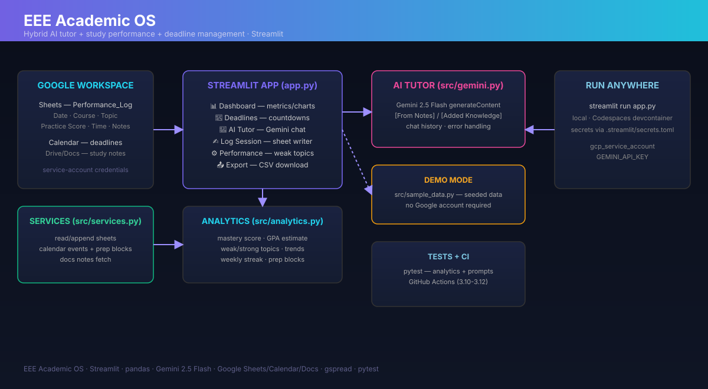
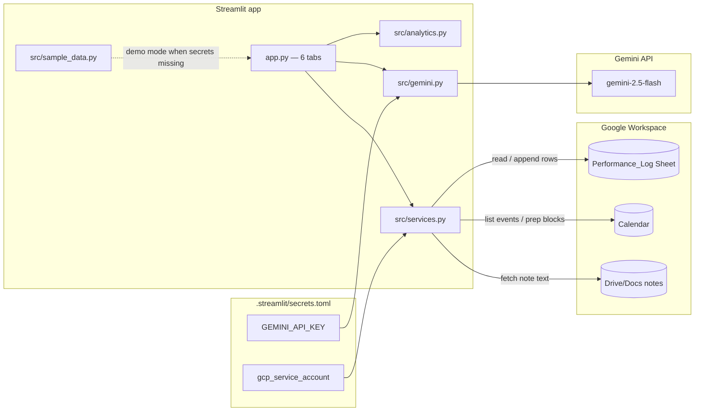

# EEE Academic OS — Architecture

> Design document for the hybrid AI + performance + deadlines study system.

## Overview

The EEE Academic OS is a **Streamlit application** that combines three concerns
in one dashboard: (1) a Gemini-powered AI tutor grounded in the student's own
notes, (2) study-performance analytics computed from a Google Sheet, and (3)
Google Calendar deadline management with automatic prep-block scheduling.

## Data flow

## Layers

### 1. Presentation (`app.py`)

Six Streamlit tabs wired to the analytics/services modules:

- **Dashboard** — metric cards, mastery-by-course bar chart, daily practice
  trend, score-vs-time scatter.
- **Deadlines** — calendar events with `deadline_countdown()` and a per-event
  "Block prep" button.
- **AI Tutor** — chat UI holding history in `st.session_state`; calls
  `gemini.ask_gemini` with fetched notes.
- **Log Session** — form that appends a row to the sheet (or in-memory in demo).
- **Performance** — weak/strong topic tables and the full log.
- **Export** — CSV download.

### 2. Analytics core (`src/analytics.py`)

Pure, network-free, unit-tested logic:

| Function | Purpose |
|---|---|
| `mastery_score(score, hours)` | 0.7×score + 0.3×capped time factor |
| `estimate_gpa(mean)` | mean/100 × 4.0 |
| `weak_topics / strong_topics` | topic averages vs threshold |
| `topic_mastery` | per-course mean mastery |
| `trend_series` | daily mean score (time series) |
| `weekly_streak` | consecutive weeks with sessions |
| `deadline_countdown` | whole days until an event |
| `prep_block` | prep start/end before a deadline |

### 3. Services (`src/services.py`)

Thin, error-tolerant wrappers over the Google APIs via `gspread` and
`google-api-python-client`:

- `read_performance` / `append_session` — Sheets.
- `list_events` / `create_prep_block` — Calendar.
- `fetch_notes` — Drive search + Docs text extraction.

Each returns an empty/failed sentinel on error so the app never crashes.

### 4. AI tutor (`src/gemini.py`)

- `build_prompt(question, notes, history)` — pure function, unit-tested.
- `ask_gemini(...)` — calls Gemini 2.5 Flash `generateContent` with
  `[From Notes]`/`[Added Knowledge]` labeling instructions and friendly error
  messages on timeout / HTTP / network failures.

### 5. Demo mode (`src/sample_data.py`)

Deterministic seeded DataFrame (same shape as the sheet) used whenever secrets
are missing. Lets the whole app run and be screenshotted without any Google
account.

## Deployment

- **Local** — `streamlit run app.py`.
- **Codespaces** — `.devcontainer` installs deps and launches on port 8501.
- **Secrets** — `.streamlit/secrets.toml` (git-ignored): `gcp_service_account`
  + `GEMINI_API_KEY`.

## Security notes

- Secrets never enter the repository.
- Service account is scoped (sheets, drive, calendar, docs read-only).
- Every external call degrades gracefully to demo/empty behaviour.
